<!--  -->
<!--

<h1> blah </h1> -->

<!-- <iframe src="./yup.svg"></iframe> -->
<!-- <object data="./yup.svg" type="image/svg+xml"></object>   -->

1. [Mary Baylies Lab](https://mskcc.org/research/ski/labs/mary-baylies)
2. [My paper](https://pubmed.ncbi.nlm.nih.gov/30905770/)
3. My python package [brutils](http://github.com/in-tension/brutils)
